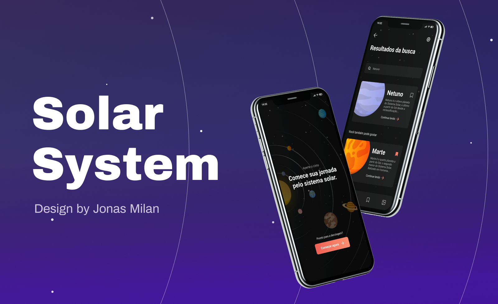

<p align="center">
  
</p>

## :rocket: Tecnologias

-  [Expo](https://expo.io/)
-  [React Native](https://reactnative.dev/)
-  [TypeScript](https://www.typescriptlang.org/)
-  [Styled-Components](https://styled-components.com/)

## 📥 Instalação e execução

```bash
# Clonando o repositório e acessando o diretório
$ git clone https://github.com/LeeonardoVargas/solar-system && cd solar-system

# Instalando as depedências
$ yarn install

# Executanto aplicação
$ yarn start
```
